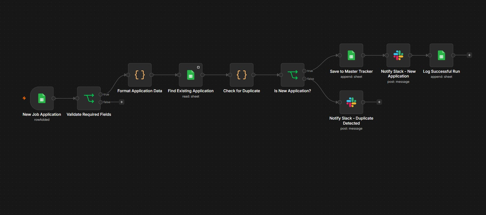
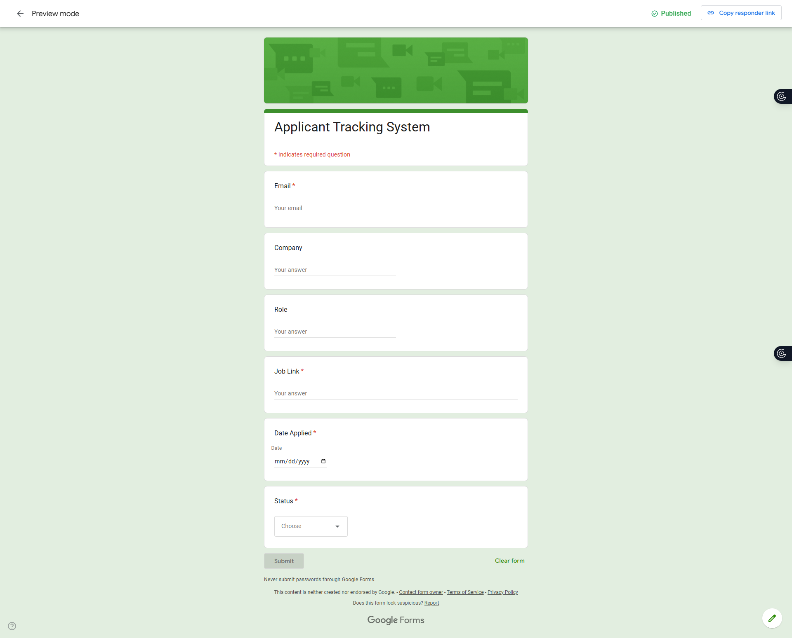
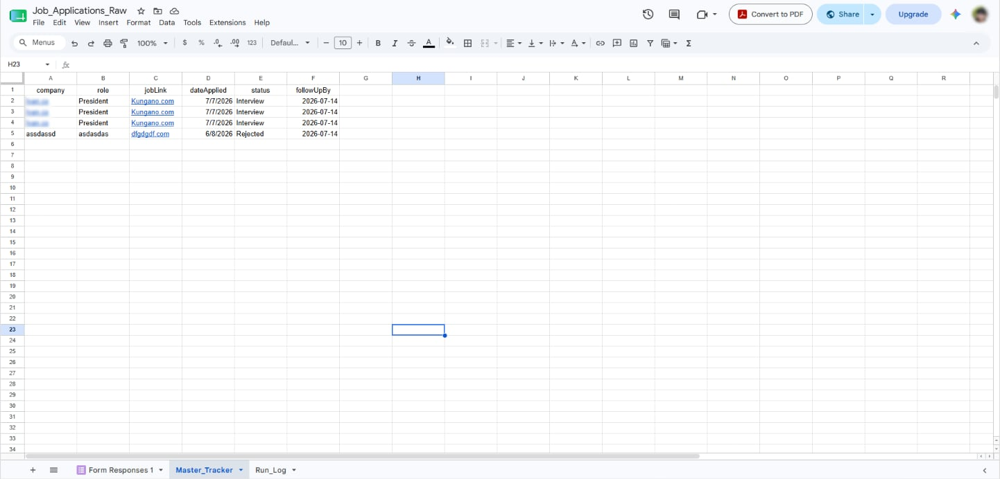
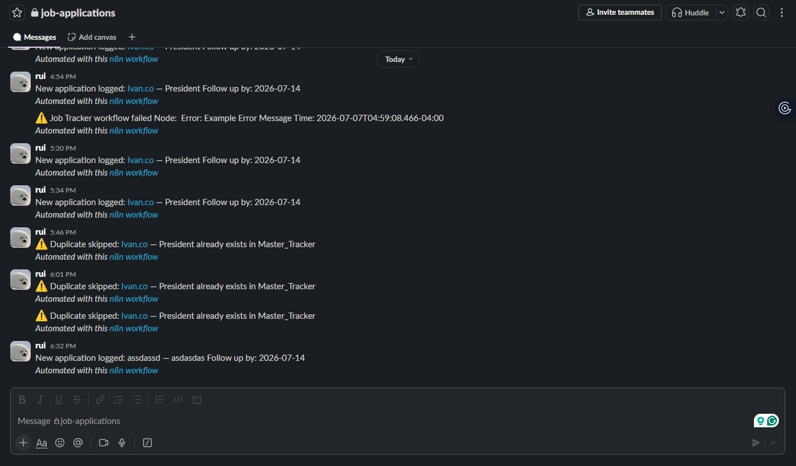
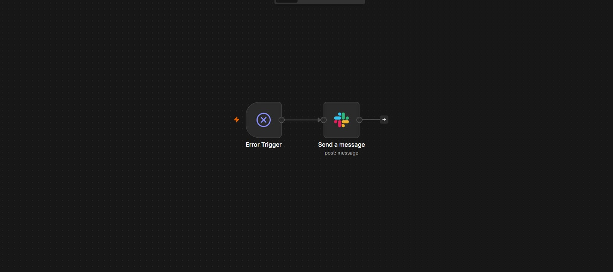

# Applicant Tracking System Automation

An automated Applicant Tracking System (ATS) built with **n8n**, **Google Forms**, **Google Sheets**, **Slack**, and **JavaScript**.

This workflow automatically processes incoming job applications, validates data, detects duplicates, updates a master tracker, sends Slack notifications, and logs successful executions.

---

## Features

- Accept job applications via Google Forms
- Validate required fields
- Detect duplicate applications
- Save unique applications to a Master Tracker
- Notify Slack when a new application is received
- Notify Slack when a duplicate is detected
- Maintain an execution log
- Dedicated error handling workflow

---

## Tech Stack

- n8n
- Google Forms
- Google Sheets
- Slack
- JavaScript

---

Before running this workflow, replace:
- YOUR_GOOGLE_SHEET_ID_HERE — your own spreadsheet ID
- YOUR_SLACK_CHANNEL_ID — your own Slack channel ID
- Reconnect Google Sheets and Slack credentials in n8n
  
---

## Workflow Overview

```
Google Form
      │
      ▼
Google Sheets Trigger
      │
      ▼
Validate Required Fields
      │
      ▼
Format Application Data
      │
      ▼
Find Existing Application
      │
      ▼
Check for Duplicate
      │
      ▼
Is New Application?
     / \
    /   \
 Yes     No
 │         │
 ▼         ▼
Save      Slack Notification
 │
 ▼
Slack Notification
 │
 ▼
Execution Log
```

---

## 📸 Screenshots

### Main Workflow



### Google Form



### Master Tracker



### Slack Notification



### Error Handler



---

## Repository Structure

```
workflow/
screenshots/
docs/
README.md
```

---

## Future Improvements

- AI Resume Parsing
- AI Resume Scoring
- Email Notifications
- Dashboard
- Analytics
- Interview Scheduling

---

## Author

**Ivan Ybañez**

Built as a portfolio project while learning business process automation using n8n.
